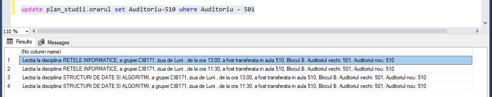
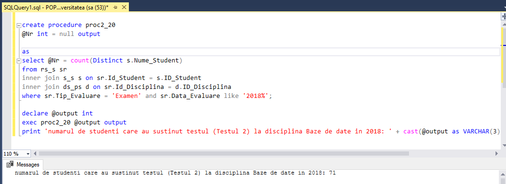
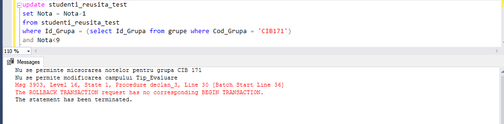
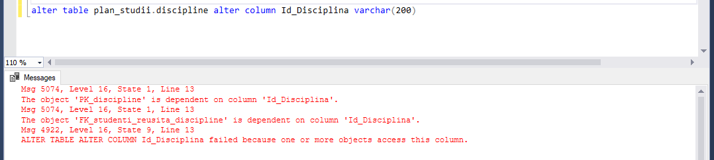
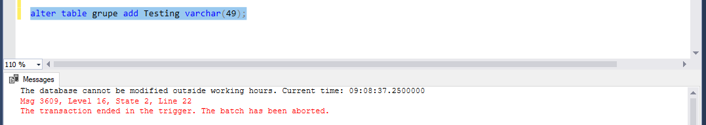
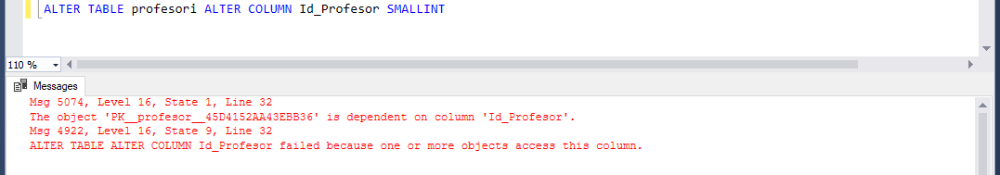

# Lab 10 : Crearea si utilizarea declansatoarelor

## Task 1
### Sa se modifice declansatorul inregistrare_noua,in asa fel,incat in cazul actualizarii auditoriului sa apara mesajul de informare, care, in afara de disciplina si ora, va afisa codul grupei afectate, ziua, blocul, auditoriul vechi si auditoriul nou.

```SQL
create trigger inregistrare_noua on plan_studii.orarul
after update
as set nocount on
if update(Auditoriu)
select 'Lectia la disciplina ' + upper(ds_ps.Disciplina)+ ', a grupei ' + grupe.Cod_Grupa +
		', ziua de ' + cast(inserted.Zi as VARCHAR(5)) + ', de la ora ' + cast(inserted.Ora as varchar(5))
		+ ', a fost transferata in aula ' + cast(inserted.Auditoriu as varchar(5)) + ', Blocul '+
		cast(inserted.Bloc as varchar(5)) + '. Auditoriul vechi: ' + cast(deleted.Auditoriu as varchar(5))+
		', Auditoriul nou: ' + cast(inserted.Auditoriu as varchar(5))
from inserted,deleted, ds_ps, grupe
where deleted.Id_Disciplina = ds_ps.Id_Disciplina
and inserted.Id_Grupa = grupe.Id_Grupa
go

update plan_studii.orarul set Auditoriu=510 where Auditoriu = 501
```


## Task 2
### Sa se creeze declansatorul, care ar asigura popularea corecta (consecutiva) a tabelelor studenti si studenti_reusita,si ar permite evitarea erorilor la nivelul cheilor externe.

```SQL
create trigger declan_2 on studenti_reusita_test
instead of INSERT
	as set nocount on
	insert into rs_s 
	select * from inserted
	where Id_Student in (select Id_Student from s_s)
 	go

insert into studenti_reusita_test values ((select max(Id_Student) from s_s), 103, 104, 1, 'Examen', null, null)
select * from s_s where Id_Student= (select max(Id_Student) from s_s)
select * from rs_s where Id_Student = (select max(Id_Student) from s_s)
```


## Task 3
### Sa se creeze un declansator, care ar interzice micsorarea notelor in tabelul studenti_reusita si modificarea valorilor campului Data_Evaluare, unde valorile acestui camp sunt nenule. Declansatorul trebuie sa se lanseze, numai daca sunt afectate datele studentilor din grupa, "CIB 171". Se va afisa un mesaj de avertizare in cazul tentativei de a incalca constrangerea.

```SQL
create trigger declan_3 on studenti_reusita_test
after update
as
set nocount on
if update (Nota)
declare @ID_GRUPA int = (select Id_Grupa  
                         from grupe 
						 where Cod_Grupa = 'CIB171')
declare @count int = (select count(*) 
                      from deleted , inserted 
			          where deleted.Id_Disciplina = inserted.Id_Disciplina 
					  and deleted.Id_Grupa = inserted.Id_Grupa 
			          and deleted.Id_Profesor = inserted.Id_Profesor 
					  and deleted.Tip_Evaluare = inserted.Tip_Evaluare 
			          and deleted.Id_Student = inserted.Id_Student
			          and inserted.Nota < deleted.Nota 
			          and inserted.Id_Grupa = @ID_GRUPA)	
begin
if (@count > 0 )
print ('Nu se perminte micsorarea notelor pentru grupa CIB 171')
rollback transaction
end
if update(Data_evaluare)
		set @count = (SELECT count(*) 
		from deleted 
		where Data_Evaluare is not null and Id_Grupa = @ID_GRUPA)
		if @count > 0
		begin
			print ('Nu se permite modificarea campului Tip_Evaluare')
			rollback transaction
		end
go
```



## Task 4
### Sa se creeze un declansator DDL care ar interzice modificarea coloanei ld_Disciplina in tabelele bazei de date universitatea cu afisarea mesajului respectiv.

```SQL
create trigger declan_4 on database
for Alter_Table
as 
set nocount on
declare @nume_disciplina varchar(50)
select @nume_disciplina=eventdata().value('(/EVENT_INSTANCE/AlterTableActionList/*/Columns/Name)[1]', 'nvarchar(100)') 
if @nume_disciplina='Disciplina'
begin 
print ('Nu poate fi modificata coloana Id_Disciplina')
rollback;
end

alter table plan_studii.discipline alter column Id_Disciplina varchar(200)
```


## Task 5
### Sa se creeze un declansator DDL care ar interzice modificarea schemei bazei de date in afara orelor de lucru.

```SQL
create trigger declan_5
on database
for ALTER_TABLE
as
set nocount on
declare @CurrentTime time
declare @StartDay time
declare @EndDay time
select @CurrentTime = convert(Time, getdate())
select @StartDay = '10:00:00'
select @EndDay = '19:30:00'

if (@CurrentTime < @StartDay) or (@CurrentTime > @EndDay)
begin	
print 'The database cannot be modified outside working hours. Current time: ' + cast(@CurrentTime as varchar(20))
rollback
end
go
```


## Task 6
### Sa se creeze un declansator DDL care, la modificarea proprietatilor coloanei ld_Profesor dintr-un tabel, ar face schimbari asemanatoare in mod automat in restul tabelelor.

```SQL
create trigger declan_6
on database
for ALTER_TABLE
as
set nocount on
declare @input varchar(500)
declare @id_profesor varchar (20)
declare @table varchar (50)
declare @new_input varchar(500)

select @id_profesor = eventdata().value('(/EVENT_INSTANCE/AlterTableActionList/*/Columns/Name)[1]', 'nvarchar(max)')
if @id_profesor = 'Id_Profesor'
begin
select @input = eventdata().value ('(/EVENT_INSTANCE/TSQLCommand/CommandText)[1]', 'nvarchar(max)')
select @table = eventdata().value ('(/EVENT_INSTANCE/ObjectName)[1]','nvarchar(max)')

select @new_input = REPLACE(@id_profesor, @table, 'profesori');
execute (@new_input)

select @new_input = REPLACE(@id_profesor, @table, 'studenti_reusita1');
execute (@new_input)

select @new_input = REPLACE(@id_profesor, @table, 'orarul');
execute (@new_input)

print 'Datele au fost modificate cu succes'
end
```



