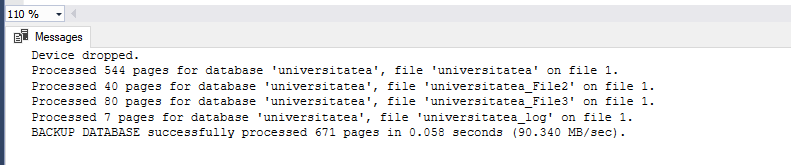
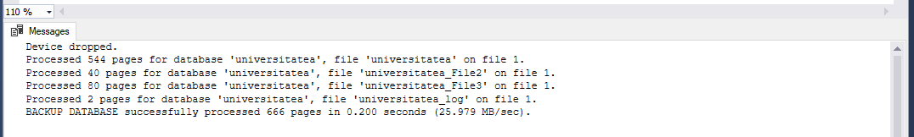
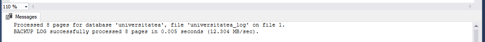
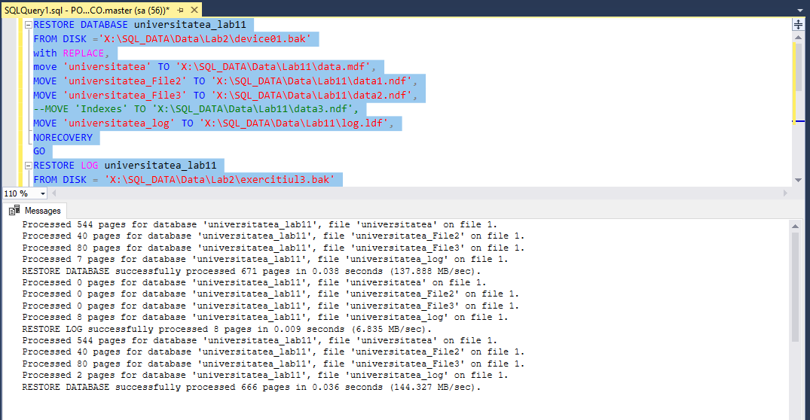

# Lab 10 : Crearea si utilizarea declansatoarelor

## Task 1
### Sa se creeze un dosar Backup_labl1. Sa se execute un backup complet al bazei de date universitatea in acest dosar. Fisierul copiei de rezerva sa se numeasca exercitiul1.bak. Sa se scrie instructiunea SQL respectiva.

```SQL
if exists (select * from master.dbo.sysdevices where name='device01')
exec sp_dropdevice 'device01' , 'delfile';
exec sp_addumpdevice 'DISK', 'device01','X:\SQL_DATA\Data\Lab2\device01.bak'
go 
backup database universitatea
to device01 with FORMAT,
name = N'universitatea-Full Database Backup'
go
```


## Task2 
### Sa se scrie instructiunea unui backup diferentiat al bazei de date universitatea. Fisierul copiei de rezerva sa se numeasca exercitiul2.bak.

```SQL
if exists (select * from master.dbo.sysdevices where name='exercitiul2')
exec sp_dropdevice 'exercitiul2' , 'delfile';
exec sp_addumpdevice 'DISK', 'device04','X:\SQL_DATA\Data\Lab2\exercitiul2.bak'
go 
backup database universitatea
to exercitiul2 with FORMAT,
name = N'Universitatea - Differential Database Backup'
go
```


## Task 3
### Sa se scrie instructiunea unui backup al jurnalului de tranzactii al bazei de date universitatea. Fisierul copiei de rezerva sa se numeasca exercitiul3.bak

```SQL
go
exec sp_addumpdevice 'DISK', 'backup_Log', 'X:\SQL_DATA\Data\Lab2\exercitiul3.bak'
go 

go
backup LOG universitatea to backup_Log
go
```


## Task 4 
### Sa se execute restaurarea consecutiva a tuturor copiilor de rezerva create. Recuperarea trebuie sa fie realizata intr-o baza de date noua universitatea_lab11. Fisierele bazei de date noise afla in dosarul BD_lab11. Sa se scrie instructiunile SQL respective 

```SQL
RESTORE DATABASE universitatea_lab11
FROM DISK ='X:\SQL_DATA\Data\Lab2\device01.bak'
with REPLACE,
move 'universitatea' TO 'X:\SQL_DATA\Data\Lab11\data.mdf',
MOVE 'universitatea_File2' TO 'X:\SQL_DATA\Data\Lab11\data1.ndf',
MOVE 'universitatea_File3' TO 'X:\SQL_DATA\Data\Lab11\data2.ndf',
MOVE 'universitatea_log' TO 'X:\SQL_DATA\Data\Lab11\log.ldf',
NORECOVERY
GO
RESTORE LOG universitatea_lab11
FROM DISK = 'X:\SQL_DATA\Data\Lab2\exercitiul3.bak'
WITH NORECOVERY
GO
RESTORE DATABASE universitatea_lab11
FROM DISK = 'X:\SQL_DATA\Data\Lab2\exercitiul_2.bak'
WITH 
NORECOVERY
GO
```

