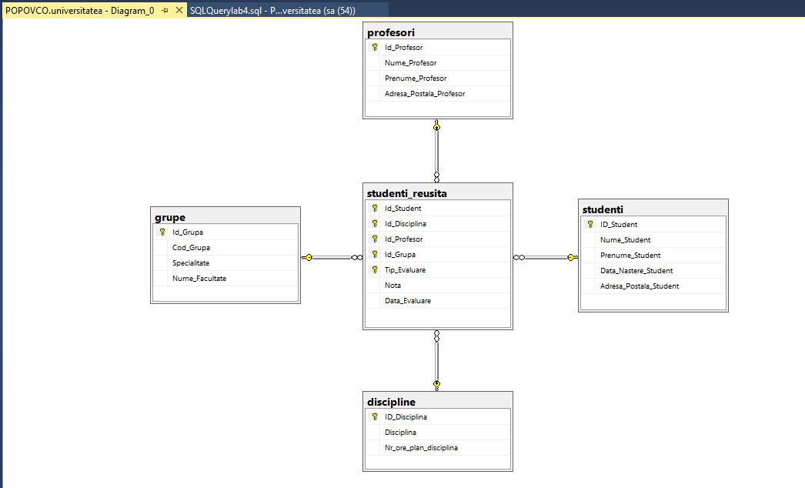

# LAB4

## Diagram: 


## Querry code: 
```
use universitatea

create table studenti (
	ID_Student int primary key identity(1,1),
	Nume_Student varchar(50),
	Prenume_Student varchar(50),
	Data_Nastere_Student date,
	Adresa_Postala_Student varchar(100)
)

create table profesori(
	Id_Profesor int primary key identity(100,1),
	Nume_Profesor varchar(50),
	Prenume_Profesor varchar(50),
	Adresa_Postala_Profesor varchar(50)
)

create table studenti_reusita(
	Id_Student int references studenti(ID_Student),
	Id_Disciplina int references discipline(ID_Disciplina),
	Id_Profesor int references profesori(ID_Profesor),
	Id_Grupa int references grupe(Id_Grupa),
	Tip_Evaluare varchar(20), -- primary key,
	Nota int,
	Data_Evaluare date,
	Check (Nota>=1),
	Check (Nota<=10)
)

insert into profesori(Nume_Profesor,Prenume_Profesor, Adresa_Postala_Profesor)
values
('Micu','Elena','Adresa1'),
('Avram','Sanda','Adresa1'),
('Mocanu','Diana','Adresa1'),
('Bivol','Ion','Adresa1'),
('Frent','Tudor','Adresa1'),
('Mircea','Maria','Adresa1'),
('Misan','Andrei','Adresa1'),
('Nazarie','Alexandru','Adresa1'),
('Olteanu','Andrei','Adresa1')

--1 Aflati toate datele despre grupele de studii de la facultate
select * from grupe
--2 Sa se obtina lista disciplinelor in ordine descrescatoare a numarului de ore
select * from discipline 
Order by Nr_ore_plan_disciplina desc
--3 Aflati cursurile (Disciplina) predate de fiecare profesor (Nume_Profesor, Prenume_Profesor) sortate descrescator dupa nume si apoi prenume
select d.Disciplina,p.Nume_Profesor,p.Prenume_Profesor
from studenti_reusita sr
inner join discipline d on sr.Id_Disciplina = d.ID_Disciplina
inner join profesori p on sr.Id_Profesor = p.Id_Profesor
order by Nume_Profesor,Prenume_Profesor DESC
--4 Afisati care dintre discipline au denumirea formata din mai mult de 20 de caractere
select * from discipline
where len(Disciplina) >20   
--5 Sa se afiseze lista studentilor al caror nume se termina in "u"
select * from studenti
where Nume_Student like '%u'
--6 Afisati numele si prenumele primilor 5 studenti, care au obtinut note in ordine descrescatoare la al 2lea test de la disciplina Baze de date. Sa se foloseasca obtiunea TOP...with ties
select top 5 with ties s.Nume_Student, s.Prenume_Student, sr.Nota
from studenti_reusita sr
inner join studenti s on sr.Id_Student = s.Id_Student
Order by Nota desc
--7 In ce grupa (Cod_Grupa) invata studentii care locuiesc pe strada 31 August
select g.Cod_Grupa
from studenti_reusita sr
inner join studenti s on sr.Id_Student = s.Id_Student
inner join grupe g on sr.Id_Grupa = g.Id_Grupa
where s.Adresa_Postala_Student like '%31 August%'
--19 Gasiti numele si prenumele profesorilor, care au predat discipline, in care studentul "Cosovanu" a fost respins (nota<5) la cel putin o proba
select p.Nume_Profesor, p.Prenume_Profesor
from studenti_reusita sr
inner join profesori p on sr.Id_Profesor = p.Id_Profesor
inner join studenti s on sr.Id_Student = s.ID_Student
where s.Nume_Student = 'Cosovanu' and sr.Nota < 5
--20 Afisati numarul de studenti care au sustinut testul (Testul 2) la disciplina Baze de date in 2018
select count(Distinct s.Nume_Student)
from studenti_reusita sr
inner join studenti s on sr.Id_Student = s.ID_Student
inner join discipline d on sr.Id_Disciplina = d.ID_Disciplina
where sr.Tip_Evaluare = 'Testul 2' and sr.Data_Evaluare like '2018%'
--21 Cate note are fiecare student? Furniati numele si prenumele lor
select s.Nume_Student, s.Prenume_Student, count(sr.Nota) as 'Nr de note'
from studenti_reusita sr
inner join studenti s on sr.Id_Student = s.ID_Student
group by s.Nume_Student
order by s.Nume_Student
--22 Sa se obtina numarul de discipline predate de fiecare profesor (Nume_Profesor, Prenume_Profesor)
select p.Nume_Profesor, count (distinct sr.Id_Disciplina) as 'Nr de discipline'
from studenti_reusita sr
inner join profesori p on sr.Id_Profesor = p.Id_Profesor
group by p.Nume_Profesor
order by p.Nume_Profesor


```