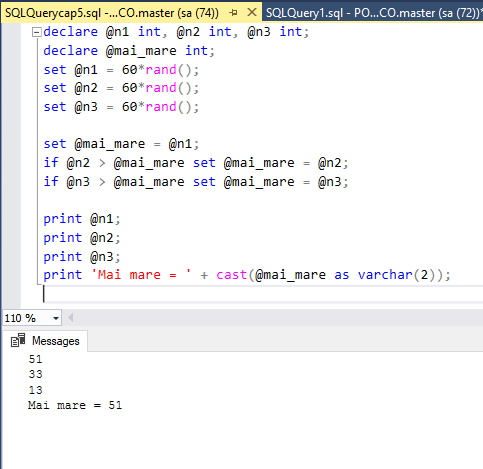
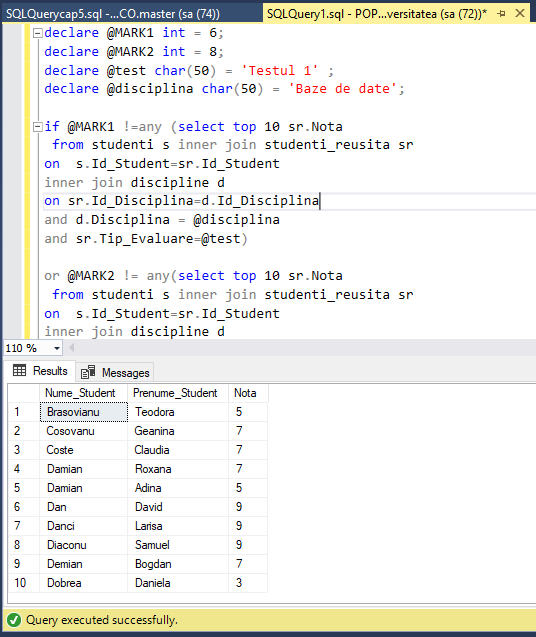
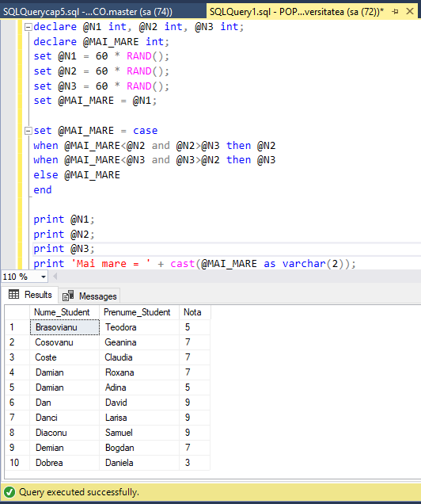
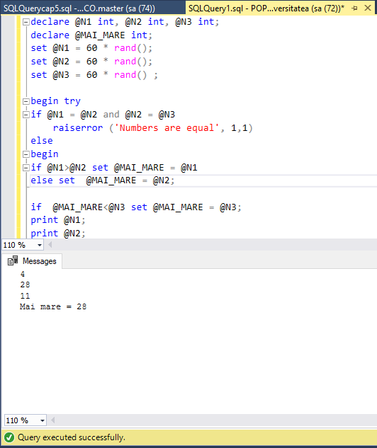
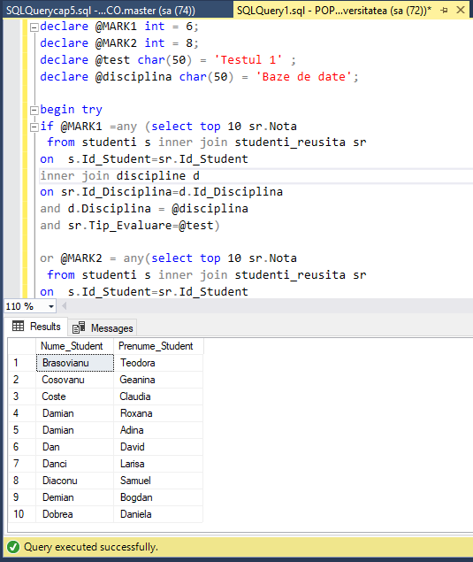

# LAB5


## Querry 1: Completati următorul cod pentru a afișa cel mai mare numar dintre cele trei numere prezentate:
```SQL
declare @n1 int, @n2 int, @n3 int;
declare @mai_mare int;
set @n1 = 60*rand();
set @n2 = 60*rand();
set @n3 = 60*rand();

set @mai_mare = @n1;
if @n2 > @mai_mare set @mai_mare = @n2;
if @n3 > @mai_mare set @mai_mare = @n3;

print @n1;
print @n2;
print @n3;
print 'Mai mare = ' + cast(@mai_mare as varchar(2));
```


## Querry 2: Afișati primele zece date (numele, prenumele studentului) în funcție de valoarea notei (cu excepția notelor 6 și 8) a studentului la primul test al disciplinei Baze de date, folosind structura de altemativă IF. .. ELSE. Sa se foloseasca variabilele.
```SQL
declare @MARK1 int = 6;
declare @MARK2 int = 8;
declare @test char(50) = 'Testul 1' ;
declare @disciplina char(50) = 'Baze de date';

if @MARK1 !=any (select top 10 sr.Nota
 from studenti s inner join studenti_reusita sr
on	s.Id_Student=sr.Id_Student
inner join discipline d
on sr.Id_Disciplina=d.Id_Disciplina
and d.Disciplina = @disciplina
and sr.Tip_Evaluare=@test)

or @MARK2 != any(select top 10 sr.Nota
 from studenti s inner join studenti_reusita sr
on	s.Id_Student=sr.Id_Student
inner join discipline d
on sr.Id_Disciplina=d.Id_Disciplina
and d.Disciplina = @disciplina
and sr.Tip_Evaluare=@test)


begin
select  distinct top 10  s.Nume_Student,s.Prenume_Student,sr.Nota
from studenti s inner join studenti_reusita sr
on	s.Id_Student=sr.Id_Student
inner join discipline d
on sr.Id_Disciplina=d.Id_Disciplina
and d.Disciplina = @disciplina
and sr.Tip_Evaluare=@test
end
```


## Querry 3: Rezolvați aceeași sarcină, 1, apelând la structura selectivă CASE.
```SQL
declare @N1 int, @N2 int, @N3 int;
declare @MAI_MARE int;
set @N1 = 60 * RAND();
set @N2 = 60 * RAND();
set @N3 = 60 * RAND();
set @MAI_MARE = @N1;

set @MAI_MARE = case 
when @MAI_MARE<@N2 and @N2>@N3 then @N2
when @MAI_MARE<@N3 and @N3>@N2 then @N3
else @MAI_MARE
end

print @N1;
print @N2;
print @N3;
print 'Mai mare = ' + cast(@MAI_MARE as varchar(2));
```


## Querry 4.1: Modificati exercitiile din sarcinile 1 și 2 pentru a include procesarea erorilor cu TRY și CATCH, și RAISERRROR.
```SQL
declare @N1 int, @N2 int, @N3 int;
declare @MAI_MARE int;
set @N1 = 60 * rand();
set @N2 = 60 * rand();
set @N3 = 60 * rand() ;

begin try
if @N1 = @N2 and @N2 = @N3 
    raiserror ('Numbers are equal', 1,1)
else
begin
if @N1>@N2 set @MAI_MARE = @N1
else set  @MAI_MARE = @N2;

if  @MAI_MARE<@N3 set @MAI_MARE = @N3;
print @N1;
print @N2;
print @N3;
print 'Mai mare = ' + cast(@MAI_MARE as varchar(2));
end
end try

begin catch
print ' An error has been occured!' 
print 'The details of the error'
print ' The error status:' + cast(ERROR_STATE() as varchar(20))
print ' The error line:' + cast(ERROR_LINE() as varchar(20))
end catch
```


## Querry 4.2: 
```SQL
declare @MARK1 int = 6;
declare @MARK2 int = 8;
declare @test char(50) = 'Testul 1' ;
declare @disciplina char(50) = 'Baze de date';

begin try
if @MARK1 =any (select top 10 sr.Nota
 from studenti s inner join studenti_reusita sr
on	s.Id_Student=sr.Id_Student
inner join discipline d
on sr.Id_Disciplina=d.Id_Disciplina
and d.Disciplina = @disciplina
and sr.Tip_Evaluare=@test)

or @MARK2 = any(select top 10 sr.Nota
 from studenti s inner join studenti_reusita sr
on	s.Id_Student=sr.Id_Student
inner join discipline d
on sr.Id_Disciplina=d.Id_Disciplina
and d.Disciplina = @disciplina
and sr.Tip_Evaluare=@test)

raiserror('Toti studenti au numai note de 6 si 8',2,2);
else

begin
select  distinct top 10  s.Nume_Student,s.Prenume_Student
from studenti s inner join studenti_reusita sr
on	s.Id_Student=sr.Id_Student
inner join discipline d
on sr.Id_Disciplina=d.Id_Disciplina
and d.Disciplina = @disciplina
and sr.Tip_Evaluare=@test

end
end try
begin catch
print ' An error has been occured!' 
print 'The details of the error'
print ' The error status:' + cast(ERROR_STATE() as varchar(20))
print ' The error line:' + cast(ERROR_LINE() as varchar(20))
end catch
```

