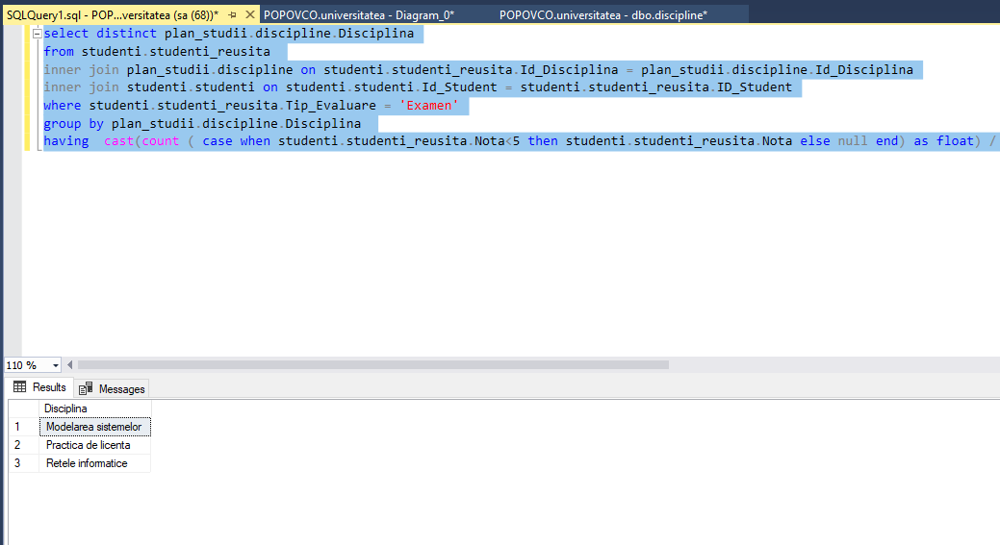

# Lab 7 : Diagrame, Scheme și Sinonime

### Task1: Creați o diagramă a bazei de date, folosind forma de vizualizare standard, structura căreia este descrisă la începutul sarcinilor practice din capitolul 4.


### Task2: Să se adauge constrîngeri referențiale (legate cu tabelele studenti și profesori) necesare coloanelor Sef_grupa și Prof_Indrumator (sarcina3, capitolul 6) din tabelul grupe


### Task3: La diagrama construită, să se adauge și tabelul orarul definit în capitolul 6 al acestei lucrari:tabelul orarul conține identificatorul disciplinei (ld_Disciplina), identificatorul profesorului(Id_Profesor) și blocul de studii (Bloc). Cheia tabelului este constituită din trei cîmpuri:identificatorul grupei (Id_ Grupa), ziua lectiei (Z1), ora de inceput a lectiei (Ora), sala unde are loc lectia (Auditoriu)

```SQL
create table orarul 
( 
	Id_Disciplina int,
	Id_Profesor int,
	Id_Grupa smallint default(1),
	Zi char(10),
	Ora Time,
    Auditoriu int,
	Bloc char(1) default('B'),
	PRIMARY KEY (Id_Grupa, Zi, Ora, Auditoriu)
					  )
Insert orarul (Id_Disciplina , Id_Profesor, Zi, Ora, Auditoriu)
       values ( 107, 101, 'Luni','08:00', 202 )
Insert orarul (Id_Disciplina , Id_Profesor, Zi, Ora, Auditoriu)
       values ( 108, 101, 'Luni','11:30', 501 )
Insert orarul (Id_Disciplina , Id_Profesor, Zi, Ora, Auditoriu)
       values ( 109, 117, 'Luni','13:00', 501 )

INSERT INTO orarul (Id_Disciplina, Id_Profesor, Id_Grupa, Zi, Ora,Auditoriu)
values (
	        (select Id_Disciplina from discipline where Disciplina = 'Structuri de date si algoritmi'),
	        (select Id_Profesor from profesori where Nume_Profesor = 'Bivol' and Prenume_Profesor = 'Ion'),
		    (select Id_Grupa from grupe where Cod_Grupa = 'INF171'), 
		    'Luni', 
		    '08:00',
		    113)

INSERT INTO orarul (Id_Disciplina, Id_Profesor, Id_Grupa, Zi, Ora,Auditoriu)
values (
	        (select Id_Disciplina from discipline where Disciplina = 'Programe aplicative'),
		    (select Id_Profesor from profesori where Nume_Profesor = 'Mircea' and Prenume_Profesor = 'Sorin'),
		    (select Id_Grupa from grupe where Cod_Grupa = 'INF171'), 
		    'Luni', 
		    '11:30',
		    401)

INSERT INTO orarul (Id_Disciplina, Id_Profesor, Id_Grupa, Zi, Ora,Auditoriu)
values (
	        (select Id_Disciplina from discipline where Disciplina = 'Baze de date'),
		    (select Id_Profesor from profesori where Nume_Profesor = 'Micu' and Prenume_Profesor = 'Elena'),
		    (select Id_Grupa from grupe where Cod_Grupa = 'INF171'), 
		    'Luni', 
		    '13:00',
		    805)
```


### Task4: Tabelul orarul trebuie să conțină și 2 chei secundare: (Zi, Ora, Id_ Grupa, Id_ Profesor) și (Zi, Ora, ld_Grupa, ld_Disciplina).

1. (Zi, Ora, Id_ Grupa, Id_ Profesor)


2. (Zi, Ora, ld_Grupa, ld_Disciplina)


### Task5: În diagramă, de asemenea, trebuie sa se definească constrângerile referențiale (FK-PK) ale atributelor ld_Disciplina, ld_Profesor, Id_ Grupa din tabelul orarul cu atributele tabelelor respective.


### Task6: Creați, în baza de date universitatea, trei scheme noi: cadre_didactice, plan_studii și studenti. Transferați tabelul profesori din schema dbo in schema cadre didactice, ținînd cont de dependentele definite asupra tabelului menționat. În același mod să se trateze tabelele orarul,discipline care aparțin schemei plan_studii și tabelele studenți, studenti_reusita, care apartin schemei studenti. Se scrie instructiunile SQL respective.


### Task7: Modificati 2-3 interogari asupra bazei de date universitatea prezentate in capitolul 4 astfel ca numele tabelelor accesate sa fie descrise in mod explicit, ținînd cont de faptul ca tabelele au fost mutate in scheme noi.

#### Interogation 19
```SQL
select distinct cadre_didactice.profesori.Nume_Profesor,cadre_didactice.profesori.Prenume_Profesor
from studenti.studenti_reusita
inner join cadre_didactice.profesori on studenti.studenti_reusita.Id_Profesor = cadre_didactice.profesori.Id_Profesor
inner join studenti.studenti on studenti.studenti_reusita.Id_Student = studenti.studenti.Id_Student
where studenti.studenti.Nume_Student = 'Cosovanu' and studenti.studenti_reusita.Nota<5
```


#### Interogation 21
```SQL
select studenti.studenti.Nume_Student, count(studenti.studenti_reusita.Nota) as 'Nr de note'
from studenti.studenti_reusita 
inner join studenti.studenti on studenti.studenti_reusita.Id_Student = studenti.studenti.ID_Student
group by studenti.studenti.Nume_Student
order by studenti.studenti.Nume_Student
```


#### Interogation 39
```SQL
select distinct plan_studii.discipline.Disciplina
from studenti.studenti_reusita 
inner join plan_studii.discipline on studenti.studenti_reusita.Id_Disciplina = plan_studii.discipline.Id_Disciplina
inner join studenti.studenti on studenti.studenti.Id_Student = studenti.studenti_reusita.ID_Student
where studenti.studenti_reusita.Tip_Evaluare = 'Examen'
group by plan_studii.discipline.Disciplina 
having  cast(count ( case when studenti.studenti_reusita.Nota<5 then studenti.studenti_reusita.Nota else null end) as float) / count(studenti.studenti.Nume_Student) < 0.05
```


### Task8: Creați sinonimele respective pentru a simplifica interogările construite în exercițiul precedent și reformulați interogările, folosind sinonimele create.

```SQL
CREATE SYNONYM s_s FOR studenti.studenti
CREATE SYNONYM rs_s FOR studenti.studenti_reusita
CREATE SYNONYM ds_ps FOR plan_studii.discipline
CREATE SYNONYM pf_cd FOR cadre_didactice.profesori

--19 Gasiti numele si prenumele profesorilor, care au predat discipline, in care studentul "Cosovanu" a fost respins (nota<5) la cel putin o proba
select distinct pf_cd.Nume_Profesor, pf_cd.Prenume_Profesor
from rs_s
inner join pf_cd on rs_s.Id_Profesor = pf_cd.Id_Profesor
inner join s_s on rs_s.Id_Student = s_s.Id_Student
where s_s.Nume_Student = 'Cosovanu' and rs_s.Nota<5

--21 Cate note are fiecare student? Furniati numele si prenumele lor
select s_s.Nume_Student, count(rs_s.Nota) as 'Nr de note'
from rs_s
inner join s_s on rs_s.Id_Student = rs_s.ID_Student
group by s_s.Nume_Student
order by s_s.Nume_Student

--39 Gasiti denumirile disciplinelor la care nu au sustinut examenul, in medie, peste 5% de studenti.
select distinct ds_ps.Disciplina
from rs_s
inner join ds_ps on rs_s.Id_Disciplina = ds_ps.Id_Disciplina
inner join s_s on rs_s.Id_Student = s_s.ID_Student
where rs_s.Tip_Evaluare = 'Examen'
group by ds_ps.Disciplina 
having  cast(count ( case when rs_s.Nota<5 then rs_s.Nota else null end) as float) / count(s_s.Nume_Student) < 0.05
```

