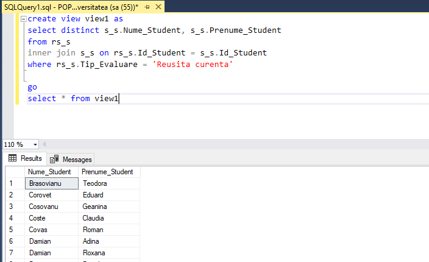
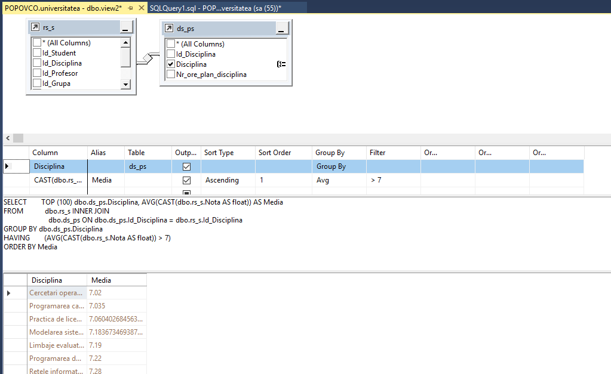
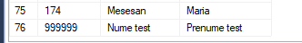
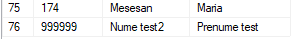
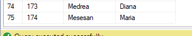

# Lab 8 : Administrarea viziunilor si a expresiilor-tabel

### Task1: Sa se creeze doua viziuni in baza interogarilor formulate in doua exercitii indicate din capitolul Prima viziune sa fie construita in Editorul de interogari, iar a doua, utilizand View Designer.

#### Editor
```SQL
create view view1 as
select distinct s_s.Nume_Student, s_s.Prenume_Student
from rs_s
inner join s_s on rs_s.Id_Student = s_s.Id_Student
where rs_s.Tip_Evaluare = 'Reusita curenta'

go
select * from view1
```


#### Designer



### Task2: Sa se scrie cate un exemplu de instructiuni INSERT, UPDATE, DELETE asupra viziunilor create. Sa se adauge comentariile respective referitoare la rezultatele executarii acestor instructiuni.

```SQL
create view view3 as
select Id_Student,Nume_Student, Prenume_Student
from s_s

INSERT INTO view3
values (999999,'Nume test', 'Prenume test')

select * from view3 
```

```SQL
UPDATE view3
SET Nume_Student = 'Nume test2'
WHERE Id_Student = 999999

select * from view3 
```

```SQL
DELETE FROM view3 WHERE Nume_Student = 'Nume test2'

select * from view3 
```
