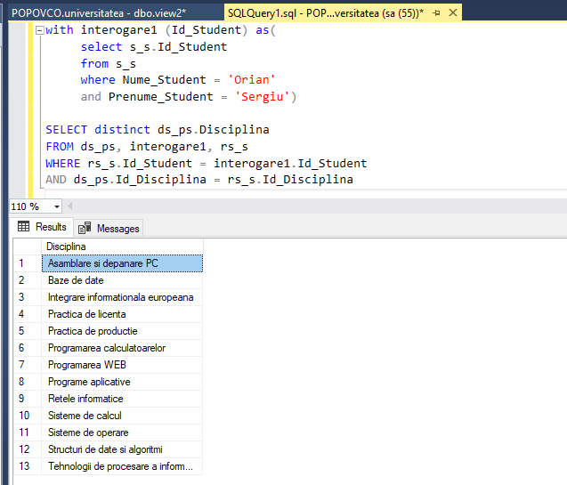
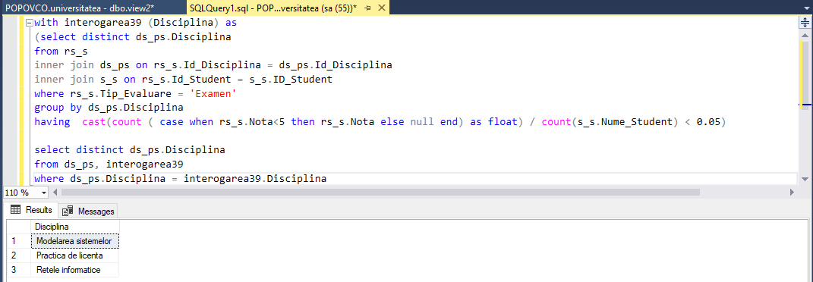
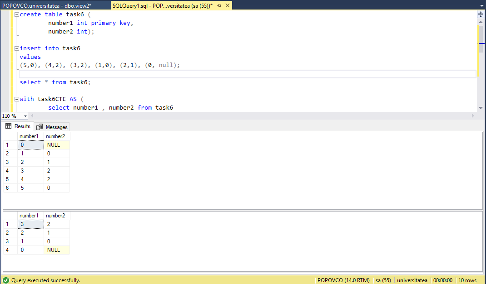

# Lab 8 : Administrarea viziunilor si a expresiilor-tabel

### Task1: Sa se creeze doua viziuni in baza interogarilor formulate in doua exercitii indicate din capitolul Prima viziune sa fie construita in Editorul de interogari, iar a doua, utilizand View Designer.

#### Editor
```SQL
create view view1 as
select distinct s_s.Nume_Student, s_s.Prenume_Student
from rs_s
inner join s_s on rs_s.Id_Student = s_s.Id_Student
where rs_s.Tip_Evaluare = 'Reusita curenta'

go
select * from view1
```


#### Designer


### Task2: Sa se scrie cate un exemplu de instructiuni INSERT, UPDATE, DELETE asupra viziunilor create. Sa se adauge comentariile respective referitoare la rezultatele executarii acestor instructiuni.

```SQL
create view view3 as
select Id_Student,Nume_Student, Prenume_Student
from s_s

insert into view3
values (999999,'Nume test', 'Prenume test')

select * from view3 
```

```SQL
update view3
set Nume_Student = 'Nume test2'
where Id_Student = 999999

select * from view3 
```

```SQL
delete from view3 where Nume_Student = 'Nume test2'

select * from view3 
```


### Task3: Sa se scrie instructiunile SQL care ar modifica viziunile create (in exercitiul 1) in asa fel, incat sa nu fie posibila modificarea sau stergerea tabelelor pe care acestea sunt definite si viziunile sa nu accepte operatiuni DML, daca conditiile clauzei WHERE nu sunt satisfacute.

```SQL
alter view view1 with schemabinding as
select distinct studenti.Nume_Student, studenti.Prenume_Student
from studenti.studenti_reusita
inner join studenti.studenti on studenti.studenti_reusita.Id_Student = studenti.studenti.Id_Student
where studenti.studenti_reusita.Tip_Evaluare = 'Reusita curenta'
with check option;
```

```SQL
alter view view2 with schemabinding as
select plan_studii.discipline.Disciplina, AVG(cast(studenti.studenti_reusita.Nota as float)) as Media
from studenti.studenti_reusita
inner join plan_studii.discipline on studenti.studenti_reusita.Id_Disciplina = plan_studii.discipline.Id_Disciplina
group by plan_studii.discipline.Disciplina
having AVG(cast(studenti.studenti_reusita.Nota as float)) > 7
with check option;
```

### Task4: Sa se scrie instructiunile de testare a proprietatilor noi definite

```SQL

alter table studenti.studenti drop column Nume_Student

insert into view1
values('Tester','Tester')

alter table plan_studii.discipline drop column Disciplina

insert into view2
values('Testing', 1)
```

### Task5: Sa se rescrie 2 interogari formulate in exercitiile din capitolul 4, in asa fel incat interogarile imbricate sa fie redate sub forma expresiilor CTE.

```SQL
with interogare1 (Id_Student) as(
	 select s_s.Id_Student
     from s_s
     where Nume_Student = 'Orian'
     and Prenume_Student = 'Sergiu')

select distinct ds_ps.Disciplina
from ds_ps, interogare1, rs_s
where rs_s.Id_Student = interogare1.Id_Student
and ds_ps.Id_Disciplina = rs_s.Id_Disciplina
```


```SQL
--39 Gasiti denumirile disciplinelor la care nu au sustinut examenul, in medie, peste 5% de studenti.
with interogarea39 (Disciplina) as
(select distinct ds_ps.Disciplina
from rs_s
inner join ds_ps on rs_s.Id_Disciplina = ds_ps.Id_Disciplina
inner join s_s on rs_s.Id_Student = s_s.ID_Student
where rs_s.Tip_Evaluare = 'Examen'
group by ds_ps.Disciplina 
having  cast(count ( case when rs_s.Nota<5 then rs_s.Nota else null end) as float) / count(s_s.Nume_Student) < 0.05)

select distinct ds_ps.Disciplina
from ds_ps, interogarea39
where ds_ps.Disciplina = interogarea39.Disciplina
```


### Task6:

#### 6.1: Se considera un graf orientat, si fie se doreste parcursa calea de la nodul id = 3 la nodul unde id = 0. Sa se faca reprezentarea grafului orientat in forma de expresie-tabel recursiv.

```SQL
                       [4]
                        |
                        v
  [5] -> [0] <- [1] <- [2]
                        ^
                        |
                       [3]
```

#### 6.2: Sa se observe instructiunea de dupa UNION ALL a membrului recursiv, precum si partea de pana la UNION ALL reprezentata de membrul-ancora.

```SQL
create table task6 (
		number1 int primary key,
		number2 int);

insert into task6 
values
(5,0), (4,2), (3,2), (1,0), (2,1), (0, null);

select * from task6;

with task6CTE AS (
		select number1 , number2 from task6
		where number1 = 3 and number2 = 2
		
		union all
		
		select task6.number1, task6.number2 from task6
		inner join task6CTE
		on task6.number1 = task6CTE.number2	
)
SELECT * from task6CTE
```
