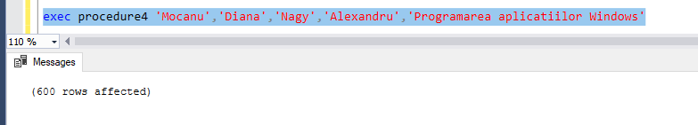
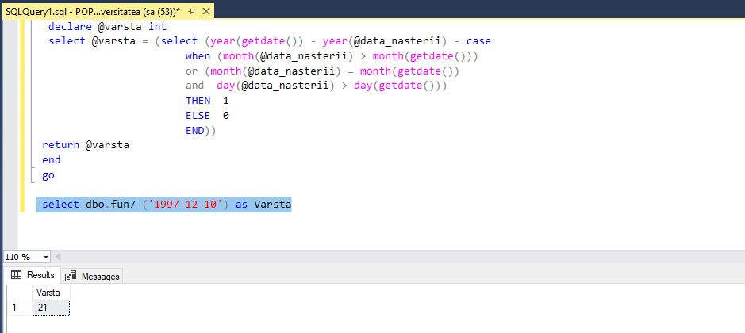
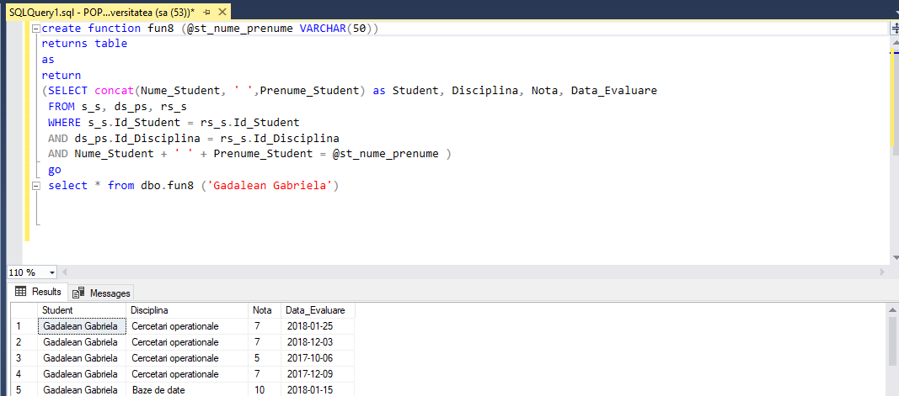
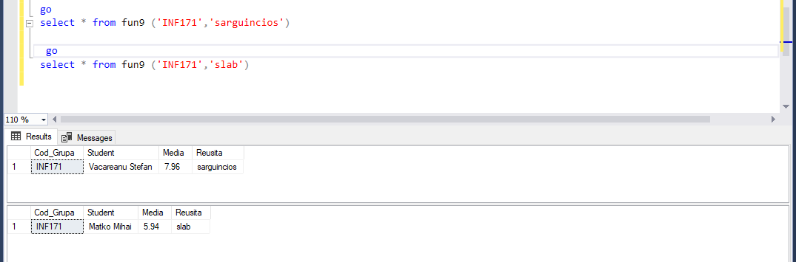

# Lab 9 : Crearea procedurilor stocate si a functiilor definite de utilizator

## Task 1
### Sa se creeze proceduri stocate in baza exercitiilor (2 exercitii) din capitolul 4. Parametrii de intrare trebuie sa corespunda criteriilor din clauzele WHERE ale exercitiilor respective.

```SQL
--Afisati numarul de studenti care au sustinut testul (Testul 2) la disciplina Baze de date in 2018
create procedure proc_20
@Tip_Evaluare varchar(50)

as
select count(Distinct s.Nume_Student)
from rs_s sr
inner join s_s s on sr.Id_Student = s.ID_Student
inner join ds_ps d on sr.Id_Disciplina = d.ID_Disciplina
where sr.Tip_Evaluare = @Tip_Evaluare and sr.Data_Evaluare like '2018%'

exec proc_20 @Tip_Evaluare = 'Testul 2'
```


```SQL
--39 Gasiti denumirile disciplinelor la care nu au sustinut examenul, in medie, peste 5% de studenti.
create procedure proc_39 
@Percentage float

as
select distinct d.Disciplina
from rs_s sr
inner join ds_ps d on sr.Id_Disciplina = d.Id_Disciplina
inner join s_s s on sr.Id_Student = s.ID_Student
where sr.Tip_Evaluare = 'Examen'
group by d.Disciplina 
having  cast(count ( case when sr.Nota<5 then sr.Nota else null end) as float) / count(s.Nume_Student) < @Percentage

exec proc_39 @Percentage = 0.05
```


## Task 2 
### Sa se creeze o procedura stocata, care nu are niciun parametru de intrare si poseda un parametru de iesire. Parametrul de iesire trebuie sa returneze numarul de studenti, care nu au sustinut cel putin o forma de evaluare (nota mai mica de 5 sau valoare NULL).


```SQL

create procedure proc2_20
@Nr int = null output

as
select @Nr = count(Distinct s.Nume_Student)
from rs_s sr
inner join s_s s on sr.Id_Student = s.ID_Student
inner join ds_ps d on sr.Id_Disciplina = d.ID_Disciplina
where sr.Tip_Evaluare = 'Examen' and sr.Data_Evaluare like '2018%';

declare @output int
exec proc2_20 @output output
print 'numarul de studenti care au sustinut testul (Testul 2) la disciplina Baze de date in 2018: ' + cast(@output as VARCHAR(3))
```


## Task 3
### Sa se creeze o procedura stocata, care ar insera in baza de date informatii despre un student nou. In calitate de parametri de intrare sa serveasca datele personale ale studentului nou si Cod_Grupa. Sa se genereze toate intrarile-cheie necesare in tabelul studenti_reusita. Notele de evaluare sa fie inserate ca NULL.

```SQL
create procedure addStudent
@nume varchar(60),
@prenume varchar(60),
@data date,
@adresa varchar(100),
@codGrupa char(10)
as
insert into s_s
values ((select max(Id_Student)from s_s) +1, @nume, @prenume, @data, @adresa);
insert into rs_s
values ((select max(Id_Student)from rs_s), 108, 101 , 
         (select Id_Grupa from grupe where Cod_Grupa = @codGrupa), 'Examen', NULL, '2018-11-25')

exec addStudent 'Popov','Eliodor','1997-12-10','Mun. Chisinau, str. Independentei','FAF171'
```


## Task 4
### Fie ca un profesor se elibereaza din functie la mijlocul semestrului. Sa se creeze o procedura stocata care ar reatribui inregistrarile din tabelul studenti_reusita unui alt profesor. Parametri de intrare: numele si prenumele profesorului vechi, numele si prenumele profesorului nou, disciplina. in cazul in care datele inserate sunt incorecte sau incomplete, sa se afiseze un mesaj de avertizare.

```SQL
create procedure procedure4
@old_last_name VARCHAR(50),
@old_first_name VARCHAR(50),
@new_last_name VARCHAR(50),
@new_first_name VARCHAR(50),
@disciplina VARCHAR(50)

as
if(( select ds_ps.Id_Disciplina 
     from ds_ps 
	 where Disciplina = @disciplina) in (select distinct rs_s.Id_Disciplina 
	                                     from rs_s 
										 where Id_Profesor = (select pf_cd.Id_Profesor 
										                      from pf_cd 
															  where Nume_Profesor = @old_last_name 
							                                  and Prenume_Profesor = @old_first_name)))
begin

update rs_s
set Id_Profesor = (select Id_Profesor
		           from pf_cd
		           where Nume_Profesor = @new_last_name
	               and Prenume_Profesor = @new_first_name)

where Id_Profesor = (select Id_profesor
		             from pf_cd
     		         where Nume_Profesor = @old_last_name
	                 and Prenume_Profesor = @old_first_name)
end
else
begin
  print 'ERROR! Check input!!!'
end

exec procedure4 'Mocanu','Diana','Nagy','Alexandru','Programarea aplicatiilor Windows'
```
#### ERROR


#### SUCCESS


## Task 5
### Sa se creeze o procedura stocata care ar forma o lista cu primii 3 cei mai buni studenti la o disciplina, si acestor studenti sa le fie marita nota la examenul final cu un punct (nota maximala posibila este 10). In calitate de parametru de intrare, va servi denumirea disciplinei. Procedura sa returneze urmatoarele campuri: Cod_Grupa, Nume_Prenume_Student, Disciplina, Nota_ Veche, Nota_Noua.

```SQL
create procedure procedure5
@disciplina VARCHAR(50)

as
declare @studenti_lista table (Id_Student int, Media float)
insert into @studenti_lista
	select top (3) rs_s.Id_Student, AVG(cast (Nota as float)) as Media
    from rs_s, ds_ps
	where ds_ps.Id_Disciplina = rs_s.Id_Disciplina
	and Disciplina = @disciplina
	group by rs_s.Id_Student
	order by Media desc;

select cod_grupa, s_s.Id_Student, CONCAT(nume_student, ' ', Prenume_Student) as Nume, Disciplina, nota AS Nota_Veche, iif(nota > 9, 10, nota + 1) AS Nota_Noua 
    from rs_s, ds_ps, grupe, s_s
	where ds_ps.id_disciplina = rs_s.id_disciplina
	and grupe.Id_Grupa = rs_s.Id_Grupa
	and  s_s.Id_Student = rs_s.Id_Student
	and s_s.Id_Student in (select Id_Student from @studenti_lista)
	and Disciplina = @disciplina
	and Tip_Evaluare = 'Examen';
declare @id_discipl smallint = (select Id_Disciplina  
                                from ds_ps
                                where Disciplina = @disciplina);

update rs_s
set rs_s.Nota = (CASE WHEN nota >= 9 THEN 10 ELSE nota + 1 END)
where Tip_Evaluare = 'Examen'
and Id_Disciplina = @id_discipl
and Id_Student in (select Id_Student from @studenti_lista)
go

execute procedure5 @disciplina = 'Sisteme de calcul'
```


## Task 6 
### Sa se creeze functii definite de utilizator in baza exercitiilor (2 exercitii) din capitolul 4. Parametrii de intrare trebuie sa corespunda criteriilor din clauzele WHERE ale exercitiilor respective.

```SQL
create function fun19 (@nume_student  VARCHAR(10), @reusita SMALLINT)
returns table
as
return
(
select distinct Nume_Profesor,Prenume_Profesor
from rs_s sr
inner join pf_cd p on sr.Id_Profesor = p.Id_Profesor
inner join s_s s on sr.Id_Student = s.Id_Student
where s.Nume_Student = @nume_student 
  and sr.Nota < @reusita
)

select * from fun19 ('Cosovanu',5)
```


```SQL
create function fun39 (@Percentage  float)
returns table
as
return
(
select distinct d.Disciplina
from rs_s sr
inner join ds_ps d on sr.Id_Disciplina = d.Id_Disciplina
inner join s_s s on sr.Id_Student = s.ID_Student
where sr.Tip_Evaluare = 'Examen'
group by d.Disciplina 
having  cast(count ( case when sr.Nota<5 then sr.Nota else null end) as float) / count(s.Nume_Student) < @Percentage
)

select * from fun39 (0.05)
```


## Task 7
### Sa se scrie functia care ar calcula varsta studentului. Sa se defineasca urmatorul format al functiei: <nume_functie>(<Data_Nastere_Student>).

```SQL
create function fun7 (@data_nasterii date )
  returns int
  begin
  declare @varsta int
  select @varsta = (select (year(getdate()) - year(@data_nasterii) - case
 						when (month(@data_nasterii) > month(getdate())) 
						or (month(@data_nasterii) = month(getdate()) 
						and  day(@data_nasterii) > day(getdate()))
						THEN  1
						ELSE  0
						END))
 return @varsta
 end
 go

 select dbo.fun7 ('1997-12-10') as Varsta
```


## Task 8
### Sa se creeze o functie definita de utilizator, care ar returna datele referitoare la reusita unui student. Se defineste urmatorul format al functiei : < nume_functie > (<Nume_Prenume_Student>). Sa fie afisat tabelul cu urmatoarele campuri: Nume_Prenume_Student, Disticplina, Nota, Data_Evaluare.

```SQL
create function fun8 (@st_nume_prenume VARCHAR(50))
returns table
as
return
(select concat(Nume_Student, ' ',Prenume_Student) as Student, Disciplina, Nota, Data_Evaluare
 from s_s, ds_ps, rs_s
 where s_s.Id_Student = rs_s.Id_Student
 and ds_ps.Id_Disciplina = rs_s.Id_Disciplina 
 and Nume_Student + ' ' + Prenume_Student = @st_nume_prenume )
 go
 select * from dbo.fun8 ('Gadalean Gabriela')

```


## Task 9
### Se cere realizarea unei functii definite de utilizator, care ar gasi cel mai sarguincios sau cel mai slab student dintr-o grupa. Se defineste urmatorul format al functiei: <nume_functie> (<Cod_Grupa>, <is_good>). Parametrul <is_good> poate accepta valorile "sarguincios" sau "slab", respectiv. Functia sa returneze un tabel cu urmatoarele campuri Grupa, Nume_Prenume_Student, Nota Medie , is_good. Nota Medie sa fie cu precizie de 2 zecimale.

```SQL
create function fun9 (@cod_grupa VARCHAR(10), @is_good VARCHAR(20))
returns @Student Table (Cod_Grupa varchar(10), Student varchar (100), Media decimal(4,2), Reusita varchar(20))
as
begin
		if @is_good = 'sarguincios'
		begin
			insert into @Student
   				select top (1) Cod_Grupa, concat(Nume_Student,' ',Prenume_Student) as Student,
		          				CAST(AVG( Nota * 1.0) as decimal (4,2)) as Media, @is_good
   			from grupe,s_s, rs_s
   			where grupe.Id_Grupa = rs_s.Id_Grupa
   			AND s_s.Id_Student = rs_s.Id_Student
   			AND Cod_Grupa = @cod_grupa
   			group by Cod_Grupa, Nume_Student, Prenume_Student
   			order by Media desc
 		end
else
 	begin 
 		insert into @Student
    		select top (1) Cod_Grupa, concat(Nume_Student,' ',Prenume_Student) as Student,
		 		CAST(AVG( Nota * 1.0) as decimal (4,2)) as Media, @is_good
    	from grupe,s_s, rs_s
    	where grupe.Id_Grupa = rs_s.Id_Grupa
    	AND s_s.Id_Student = rs_s.Id_Student
    	AND Cod_Grupa = @cod_grupa
    	group by Cod_Grupa, Nume_Student, Prenume_Student
    	order by Media 
 	end
RETURN 
end

go 
select * from fun9 ('INF171','sarguincios')

go 
select * from fun9 ('INF171','slab')
```
