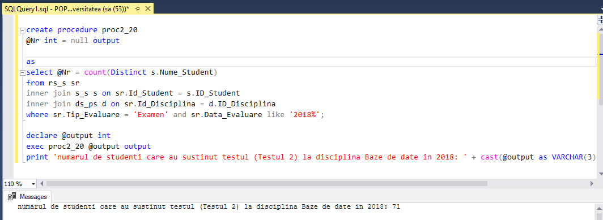

# Lab 9 : Crearea procedurilor stocate si a functiilor definite de utilizator

### Task1: Sa se creeze proceduri stocate in baza exercitiilor (2 exercitii) din capitolul 4. Parametrii de intrare trebuie sa corespunda criteriilor din clauzele WHERE ale exercitiilor respective.

```SQL
--Afisati numarul de studenti care au sustinut testul (Testul 2) la disciplina Baze de date in 2018
create procedure proc_20
@Tip_Evaluare varchar(50)

as
select count(Distinct s.Nume_Student)
from rs_s sr
inner join s_s s on sr.Id_Student = s.ID_Student
inner join ds_ps d on sr.Id_Disciplina = d.ID_Disciplina
where sr.Tip_Evaluare = @Tip_Evaluare and sr.Data_Evaluare like '2018%'

exec proc_20 @Tip_Evaluare = 'Testul 2'
```


```SQL
--39 Gasiti denumirile disciplinelor la care nu au sustinut examenul, in medie, peste 5% de studenti.
create procedure proc_39 
@Percentage float

as
select distinct d.Disciplina
from rs_s sr
inner join ds_ps d on sr.Id_Disciplina = d.Id_Disciplina
inner join s_s s on sr.Id_Student = s.ID_Student
where sr.Tip_Evaluare = 'Examen'
group by d.Disciplina 
having  cast(count ( case when sr.Nota<5 then sr.Nota else null end) as float) / count(s.Nume_Student) < @Percentage

exec proc_39 @Percentage = 0.05
```


### Task2: Sa se creeze o procedura stocata, care nu are niciun parametru de intrare si poseda un parametru de iesire. Parametrul de iesire trebuie sa returneze numarul de studenti, care nu au sustinut cel putin o forma de evaluare (nota mai mica de 5 sau valoare NULL).


```SQL

create procedure proc2_20
@Nr int = null output

as
select @Nr = count(Distinct s.Nume_Student)
from rs_s sr
inner join s_s s on sr.Id_Student = s.ID_Student
inner join ds_ps d on sr.Id_Disciplina = d.ID_Disciplina
where sr.Tip_Evaluare = 'Examen' and sr.Data_Evaluare like '2018%';

declare @output int
exec proc2_20 @output output
print 'numarul de studenti care au sustinut testul (Testul 2) la disciplina Baze de date in 2018: ' + cast(@output as VARCHAR(3))
```



